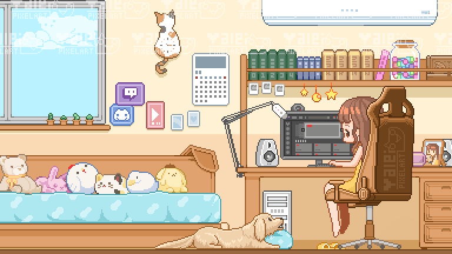

# 🎀 Hi! Welcome to my GitHub, I'm Michelle 🎀

## 🌸 a little about me 🌸

<table>
<tr>
<td valign="top" width="60%">

I'm a Computer Engineering student at the University of Waterloo who splits time between embedded systems, full-stack apps, and machine learning depending on the week. I like building things I can actually touch — FPGAs, PCBs, wearable hardware — just as much as I like shipping software. 💖

**what I'm building right now:** 🛠️

- 🔧 RTL for a 10 Gbps Ethernet packet parser at UWASIC
- 🧵 **MeshGit** — geometry-aware version control for 3D mesh files
- 🤖 **hand.shake** — an AI grip-assist wearable glove

**outside of code:** 🩷

- 📸 I love taking photos
- 🩰 I trained in Bharatanatyam (classical Indian dance) for 10 years
- 🏋️ I lift at the gym
- 📚 I'm always in the middle of a book
- 🎨 I paint and make random crafts with my hands

</td>
<td valign="top" width="40%" align="center">

</td>
</tr>
</table>

## 🎀 my tech stack 🎀

**Programming Languages:** 💅

**Frameworks & Libraries:** 🌷

**Embedded & Hardware:** 🦋

**Tools & Platforms:** 🎧

## 🎀 my GitHub contributions 🎀

<picture>
  <source media="(prefers-color-scheme: dark)" srcset="https://raw.githubusercontent.com/m76domi98/m76domi98/output/snake-dark.svg">
  <source media="(prefers-color-scheme: light)" srcset="https://raw.githubusercontent.com/m76domi98/m76domi98/output/snake.svg">
  
</picture>

thanks for stopping by, sending love 💌

